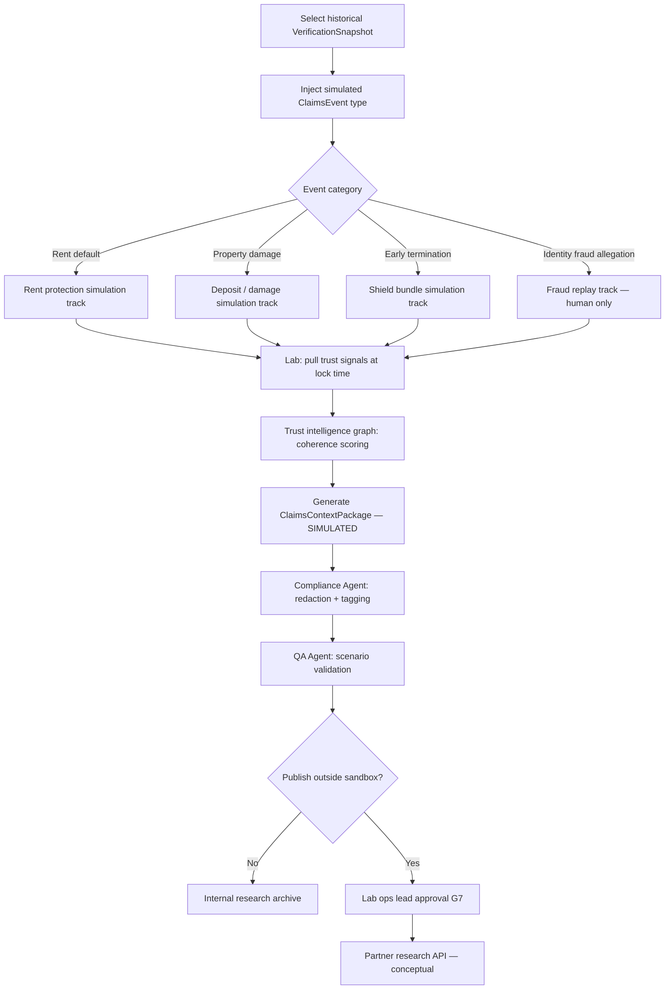
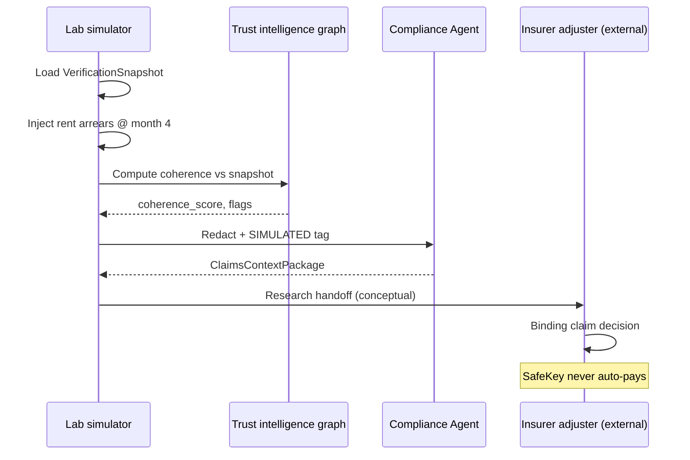
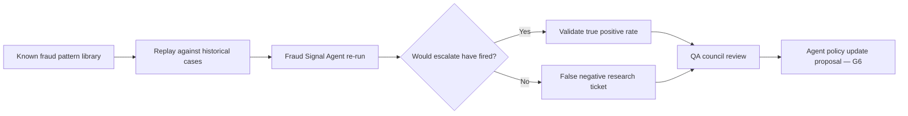

# Claims Simulation

Conceptual claims lifecycle for SafeKey Insurance Lab Phase 2. **Simulation and research only — not production claims handling.**

## Purpose

Claims simulation explores how **prior verification evidence** might inform post-tenancy insurance events without:

- Implementing claims adjudication in SafeKey Core
- Exposing simulated outcomes to landlords or tenants as binding
- Replacing insurer claims departments

All artifacts produced here are tagged **`SIMULATED`** and stored outside Core production paths.

---

## 1. Claims context model (conceptual)

| Entity | Description |
|--------|-------------|
| `VerificationSnapshot` | Immutable reference to locked recommendation + document manifest at tenancy start |
| `TenancyContext` | Lease metadata (research): start date, property class, deposit structure |
| `ClaimsEvent` (simulated) | Trigger: rent default, damage, early exit, deposit dispute, etc. |
| `ClaimsContextPackage` | Lab assembly linking snapshot → event → evidence coherence score |
| `AdjusterDecision` (human, external) | Binding outcome — always outside SafeKey |

---

## 2. Claims lifecycle (high level)

```mermaid
stateDiagram-v2
  [*] --> VerificationComplete: recommendation.locked
  VerificationComplete --> TenancyActive: Landlord decision (external)
  TenancyActive --> ClaimsTriggered: Simulated insurable event
  ClaimsTriggered --> ContextAssembly: Lab builds ClaimsContextPackage
  ContextAssembly --> CoherenceReview: Trust intelligence graph
  CoherenceReview --> HumanAdjuster: Insurer claims desk (external)
  HumanAdjuster --> Settled: Bind / deny / partial (external)
  HumanAdjuster --> Disputed: Appeal path (external)
  Settled --> [*]
  Disputed --> HumanAdjuster
```



---

## 3. Simulation workflow



---

## 4. Claims event types (simulation catalog)

| Type | Inputs from verification | Simulated questions |
|------|-------------------------|---------------------|
| **Rent arrears** | Income docs, recommendation, rent amount | Was affordability adequately verified? |
| **Deposit loss** | Deposit alternative eligibility flag | Was deposit protection eligibility consistent? |
| **Malicious damage** | Identity integrity, reference checks | Was applicant identity coherently verified? |
| **Early break** | Employment contract, move-in date | Were timeline signals consistent? |
| **Fraudulent tenancy** | Cross-case fraud signals | Was fraud escalation missed? |

---

## 5. Coherence dimensions in claims simulation

Each simulation produces scores (0–1, advisory) across:

| Dimension | Question |
|-----------|----------|
| **Identity continuity** | Does tenancy claimant match verified identity? |
| **Document consistency** | Do claim circumstances contradict verified docs? |
| **Timeline plausibility** | Do event dates align with verified employment / move-in? |
| **Verification density** | Was document pack complete at lock? |
| **Evidence coherence** | Do all signals support same narrative? |
| **Behavioral trust** | Any post-lock fraud signals relevant retroactively? |

Scores **do not** auto-determine claim payment in simulation — they populate an **adjuster briefing**.

---

## 6. Simulated adjuster briefing (output sketch)

```
ClaimsContextPackage {
  simulation_id: UUID
  watermark: SIMULATED
  verification_snapshot_ref: case_id @ lock_timestamp
  claims_event: { type, simulated_date, jurisdiction }
  coherence_summary: { ... dimensions ... }
  anomalies_at_verification: [ ... historical S2/S3 ... ]
  agent_attributions: [ { agent, policy_version, signal } ]
  missing_evidence_flags: [ ... ]
  human_adjuster_fields: { decision: null, reserved for external system }
}
```

---

## 7. Detailed workflow: rent protection simulation



---

## 8. Detailed workflow: fraud replay simulation

Used **only** for internal model improvement — never surfaced to landlords.



---

## 9. Boundaries and disclaimers

| Rule | Enforcement |
|------|-------------|
| All packages watermarked `SIMULATED` | Compliance Agent |
| No tenant notification from simulation | F2 governance |
| No landlord dashboard widget | Core separation |
| No payment rails | F9 governance |
| Adjuster decision external | Architecture |

---

## 10. Success metrics (research)

- Time to assemble ClaimsContextPackage from snapshot
- Coherence score correlation with adjuster mock decisions (panel study)
- False negative rate improvement in fraud replay
- Redaction failure rate on simulated exports (target: 0)

These metrics inform **Lab graduation criteria** — not Core KPIs.
