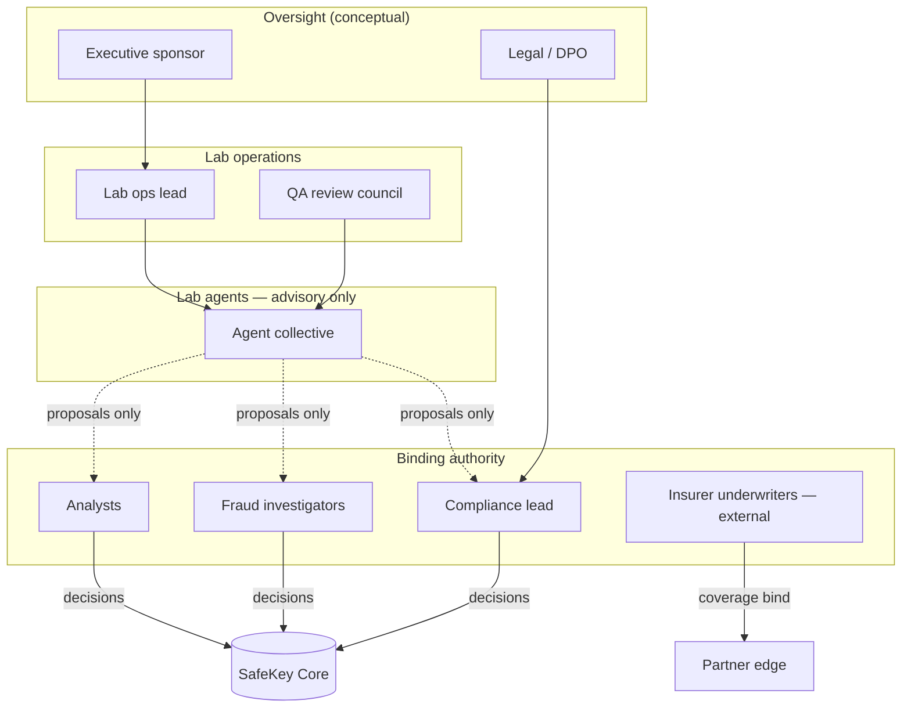
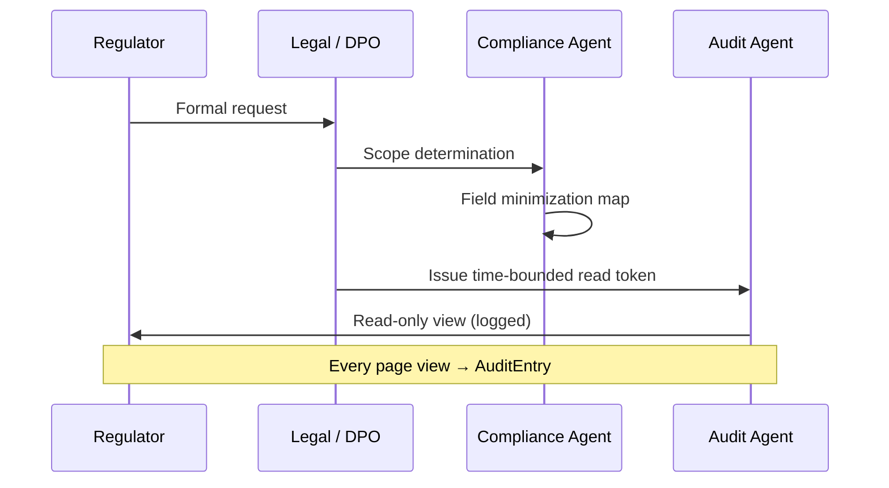

# Governance

Institutional governance model for SafeKey Insurance Lab Phase 2. **Documentation only.**

Human decision-makers remain **authoritative** at all binding stages.

---

## 1. Governance structure



---

## 2. Actions agents can never perform

| # | Forbidden action | Rationale |
|---|------------------|-----------|
| F1 | Issue or modify landlord-facing recommendation | Human analyst authority |
| F2 | Send email, SMS, or WhatsApp to tenant or landlord | Consent + brand + legal risk |
| F3 | Activate, revoke, or rotate tenant upload tokens in Core | Core security boundary |
| F4 | Delete or mutate audit entries | Regulatory evidentiary requirement |
| F5 | Bind, decline, or price insurance coverage | Insurer licensing |
| F6 | Auto-reject tenant application without human review | Fair housing / GDPR |
| F7 | Expose raw document bytes to partners by default | Data minimization |
| F8 | Modify Core UI strings, routes, or feature flags | Core / Lab separation |
| F9 | Create financial charges or refunds (Stripe) | Billing authority |
| F10 | Label an individual as fraudulent in external outputs | Defamation + process fairness |
| F11 | Override human-locked recommendation | Non-repudiation |
| F12 | Disable logging or orchestrator audit | Governance kill switch protection |

Any agent prompt or policy that implies the above must be rejected in Lab ops review.

---

## 3. Mandatory human approvals

| Gate | Trigger | Required approver | Record |
|------|---------|-------------------|--------|
| **G1 Recommendation lock** | Analyst submits final report | Named analyst | Core + Audit Agent |
| **G2 S3 escalation resolution** | Fraud / integrity escalation | Fraud investigator + analyst | Escalation + audit |
| **G3 S4 compliance hold** | Compliance Agent policy block | Compliance lead | Audit + legal ticket |
| **G4 Partner export** | Insurer package generation | Compliance Agent pass + ops ack | Export manifest hash |
| **G5 Regulator disclosure** | Statutory request | DPO + Legal | Access token + audit |
| **G6 Agent policy change** | New model, rule, or scope | Lab ops lead + QA council | Versioned policy doc |
| **G7 Claims simulation publish** | Research artifact leaves Lab sandbox | Lab ops lead | `SIMULATED` watermark required |
| **G8 Cross-case linkage** | Link cases for fraud pattern | Fraud investigator | Pseudonymization review |

Agents may **prepare** packages for G1–G5 but cannot satisfy gates alone.

---

## 4. Immutable records

| Record type | Mutability | Retention (research minimum) | Storage class |
|-------------|------------|------------------------------|---------------|
| `AuditEntry` | Append-only | 7 years (EU insurance research baseline) | WORM / object lock |
| `TrustEvent` | Append-only | Match Core case retention | Event log |
| `RecommendationLock` | Immutable after lock | Case life + statutory | Core (reference) |
| `EscalationRecord` | Append-only resolution chain | 7 years | Lab |
| `PartnerExportManifest` | Immutable at export | Contract term | Lab |
| `ConsentArtifact` | Immutable | GDPR statutory | Core (reference) |
| `AgentPolicyVersion` | Versioned; old retained | Indefinite | Lab config |

### Correction protocol

Corrections **append** a superseding entry:

```
corrects_entry_id → prior hash → new hash → human_actor → reason_code
```

Silent edits are forbidden and trigger Audit Agent S4.

---

## 5. Regulator visibility boundaries

### Default posture: **minimized read window**

| Data class | Regulator default | Requires extra approval |
|------------|-------------------|-------------------------|
| Case timeline (states) | Yes | — |
| Audit hash chain | Yes | — |
| Agent advisory scores | Summarized only | Full detail → G5 |
| Document images | **No** | G5 + statutory basis |
| Tenant PII | **No** | G5 + legal order |
| Landlord PII | **No** | G5 |
| Fraud labels | **No** | Anonymized aggregates only |
| Partner export payloads | Redacted copy | G5 |

### Regulator access flow



### Jurisdiction notes (research)

- **Greece / EU:** GDPR purpose limitation; DPIA required before production Lab export
- **Insurance:** IAIS-style auditability; no automated sole decision for coverage

---

## 6. Audit requirements

### 6.1 Continuous controls

| Control | Frequency | Owner |
|---------|-----------|-------|
| Hash chain integrity check | Daily automated | Audit Agent |
| Agent policy drift detection | Per deployment | Lab ops |
| Escalation SLA compliance | Weekly | QA council |
| Partner export redaction test | Per release | Compliance Agent |
| Kill switch functional test | Monthly | Lab ops |

### 6.2 Evidence pack (internal)

Each locked recommendation should be reconstructable from:

1. Core case snapshot reference
2. Trust event sequence
3. Agent signal versions at lock time
4. Human analyst identity and timestamp
5. Audit chain head hash

### 6.3 External audit support

- Export **manifest** (hashes, not bytes) on request
- Provide agent policy version registry
- Demonstrate forbidden action blocks (F1–F12) in test scenarios

---

## 7. Agent accountability

| Requirement | Implementation (conceptual) |
|-------------|----------------------------|
| Traceability | Every agent output tagged `agent_id`, `policy_version`, `input_event_ids` |
| Explainability | Structured rationale fields; no free-text-only verdicts |
| Appeal path | Tenant disputes handled outside Lab agents — human legal process |
| Bias monitoring | Risk Drift + Fraud agents reviewed for disparate impact quarterly |
| Decommission | Retired agents remain in audit history; policies archived |

---

## 8. Relationship to SafeKey Core governance

| Core principle | Lab alignment |
|----------------|---------------|
| Landlord never uploads tenant docs | Lab never requests landlord upload of tenant bytes |
| Calm trust UX | Lab outputs never surface raw ops jargon to Core |
| Preview / billing gates | Lab cannot bypass Core entitlements |
| Human recommendation | Lab signals are inputs only |

Core product governance documents remain authoritative for production. Lab governance **extends** but does not **override** Core for landlord-facing behavior.
