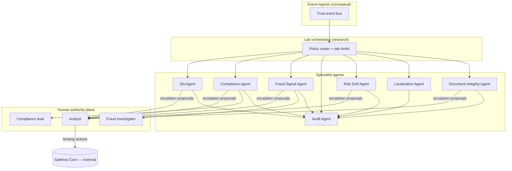

# Multi-Agent Topology

Phase 2 conceptual multi-agent architecture for SafeKey Insurance Lab. **Documentation only — no agent runtime in production.**

## Topology overview

### Orchestration principles

1. **Single-writer per signal type** — One agent owns each signal category to avoid conflicting scores.
2. **No agent chains without cap** — Max depth 3 hops; then mandatory human checkpoint.
3. **Deterministic routing** — Event type → agent set is policy-defined, not LLM-routed.
4. **Idempotent consumption** — Replayed events must not duplicate escalations.

---

## Agent catalog

Each agent follows the same contract dimensions:

| Dimension | Definition |
|-----------|------------|
| **Scope** | What inputs and cases the agent may process |
| **Permissions** | Read / write capabilities within Lab boundary |
| **Visibility** | Who may see this agent's outputs |
| **Escalation rights** | Whether it may open escalations and at what severity |
| **Failure behavior** | Safe degradation when dependencies fail |
| **Governance** | Human oversight, review cadence, kill switch |

---

## QA Agent

| Dimension | Definition |
|-----------|------------|
| **Scope** | Pre-review checklists, recommendation draft completeness, document pack coverage vs requested list |
| **Permissions** | Read: case metadata, document manifest, analyst draft. Write: advisory checklist items, completeness score (Lab only) |
| **Visibility** | SafeKey analysts, Lab ops. **Hidden from** landlords, tenants, insurers by default |
| **Escalation rights** | May open **S2** escalation if mandatory fields missing before lock |
| **Failure behavior** | If unavailable, analyst proceeds with manual checklist; Core workflow **not blocked** |
| **Governance** | Weekly false-positive review; prompt/policy version pinned in audit |

---

## Compliance Agent

| Dimension | Definition |
|-----------|------------|
| **Scope** | GDPR consent artifacts, retention class, jurisdiction rules (GR/EU research), partner export redaction |
| **Permissions** | Read: consent flags, event metadata, export payloads. Write: compliance flags, redaction maps, **hold** recommendations (Lab only) |
| **Visibility** | Compliance lead, DPO, analysts (summary flags only). **Hidden from** partners unless statutory |
| **Escalation rights** | May open **S4** on policy violation; may require human ack before `recommendation.locked` |
| **Failure behavior** | **Fail closed** for partner export; Core landlord flow continues with warning to ops |
| **Governance** | Quarterly policy review; all rule changes require Compliance lead approval |

---

## Fraud Signal Agent

| Dimension | Definition |
|-----------|------------|
| **Scope** | Upload velocity, device fingerprint anomalies, link sharing patterns, duplicate document hashes across cases |
| **Permissions** | Read: upload telemetry, hashed fingerprints, cross-case hash index. Write: fraud risk signals (non-accusatory language), S3 escalation proposals |
| **Visibility** | Fraud investigator, senior analysts. **Never** visible to landlord as accusation; tenant **never** sees fraud score |
| **Escalation rights** | **S3** proposal only; cannot label tenant as fraudster in any external channel |
| **Failure behavior** | Degrade to rule-based velocity checks; log degradation in Audit Agent stream |
| **Governance** | Bias review on geographic and device proxies; human confirms all S3 outcomes |

---

## Audit Agent

| Dimension | Definition |
|-----------|------------|
| **Scope** | All trust events, agent outputs, human actions, regulator read requests |
| **Permissions** | Read: full Lab event stream. Write: **append-only** audit entries, hash chain maintenance |
| **Visibility** | Compliance lead, regulator read window (minimized extracts). Agent outputs **not** mutable via Audit Agent |
| **Escalation rights** | May open **S4** if hash chain broken or tamper detected |
| **Failure behavior** | **Hard stop** on partner export and insurer packages until chain integrity restored |
| **Governance** | Immutable; separate ops account; no delete API |

---

## Risk Drift Agent

| Dimension | Definition |
|-----------|------------|
| **Scope** | Compare current case signals to portfolio baseline, historical analyst behavior, score drift over time |
| **Permissions** | Read: aggregated historical signals (pseudonymized), current case signals. Write: drift delta, baseline deviation notes |
| **Visibility** | Analysts, insurer partner (aggregated drift summary if contracted). **Hidden from** tenants |
| **Escalation rights** | **S2** if drift exceeds threshold; cannot change score |
| **Failure behavior** | Omit drift section from partner package; analyst notified |
| **Governance** | Baseline refresh requires ops approval; document non-discrimination review |

---

## Localization Agent

| Dimension | Definition |
|-----------|------------|
| **Scope** | Normalize agent-facing metadata across EL/EN; translate **internal** advisory strings; support regulator export locale |
| **Permissions** | Read: bilingual source strings in Lab. Write: localized agent advisory copies (Lab storage only) |
| **Visibility** | Lab ops, analysts (advisory). **Must not** write to Core `messages.ts` or landlord UI |
| **Escalation rights** | **S2** if statutory disclosure string missing for jurisdiction |
| **Failure behavior** | Fallback to English advisory; flag for human translation |
| **Governance** | Human linguist review for legal strings; no automated legal copy to Core |

---

## Document Integrity Agent

| Dimension | Definition |
|-----------|------------|
| **Scope** | File hash, format validation, metadata consistency, duplicate detection, OCR confidence (research) |
| **Permissions** | Read: document bytes via secured Lab vault mirror. Write: integrity scores, tamper flags, manifest mismatches |
| **Visibility** | Analysts, Document Integrity ops. Raw bytes **not** re-exposed to other agents unless policy allows |
| **Escalation rights** | **S3** on tamper evidence; **S2** on low OCR confidence |
| **Failure behavior** | Mark integrity as **unknown**; analyst manual review required; never auto-reject tenant |
| **Governance** | Hash algorithm upgrades logged; cross-case duplicate rules audited for fairness |

---

## Inter-agent coordination matrix

|  | QA | Compliance | Fraud | Audit | Risk Drift | Localization | Doc Integrity |
|--|:--:|:----------:|:-----:|:-----:|:----------:|:------------:|:-------------:|
| **QA** | — | shares completeness | — | logs | reads drift | reads | reads integrity |
| **Compliance** | blocks export | — | — | logs | — | reads | reads |
| **Fraud** | — | notifies | — | logs | correlates | — | reads hashes |
| **Audit** | logs all | logs all | logs all | — | logs all | logs all | logs all |
| **Risk Drift** | advises | — | correlates | logs | — | — | reads scores |
| **Localization** | translates | translates legal | — | logs | — | — | — |
| **Doc Integrity** | feeds checklist | consent on bytes | feeds fraud | logs | feeds drift | — | — |

---

## Agent runtime failure modes (global)

| Condition | System response |
|-----------|-----------------|
| Agent timeout | Skip advisory; log `agent.timeout`; human proceeds |
| Agent conflicting outputs | Orchestrator suppresses both; open S2 for analyst |
| Model hallucination guardrail trip | Discard generative content; rule-only fallback |
| Lab partition from Core | Core unaffected; replay events on reconnect |
| Kill switch engaged | All agents read-only; humans only |

---

## Explicit non-agents

The following remain **human or Core-only** — never automated in Lab Phase 2:

- Landlord rental accept / decline
- Tenant communication content
- Binding insurance coverage
- Stripe billing decisions
- Core dashboard copy changes

See [Governance](./governance.md) for forbidden actions across all agents.
