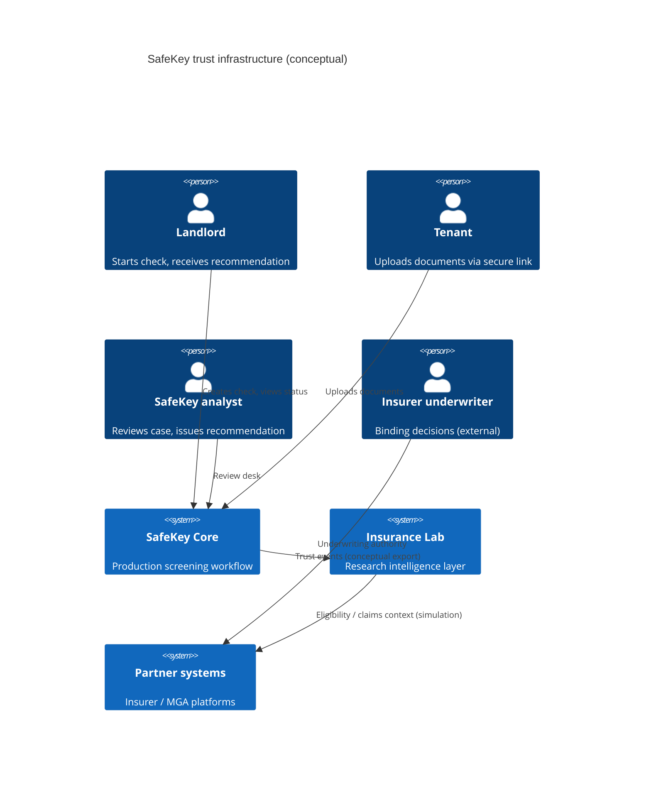
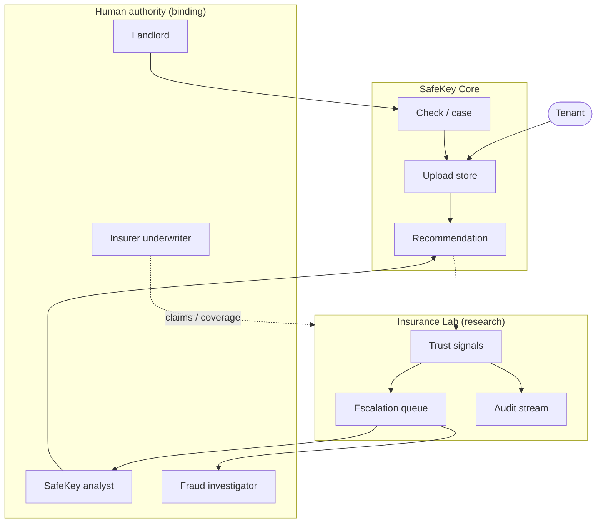
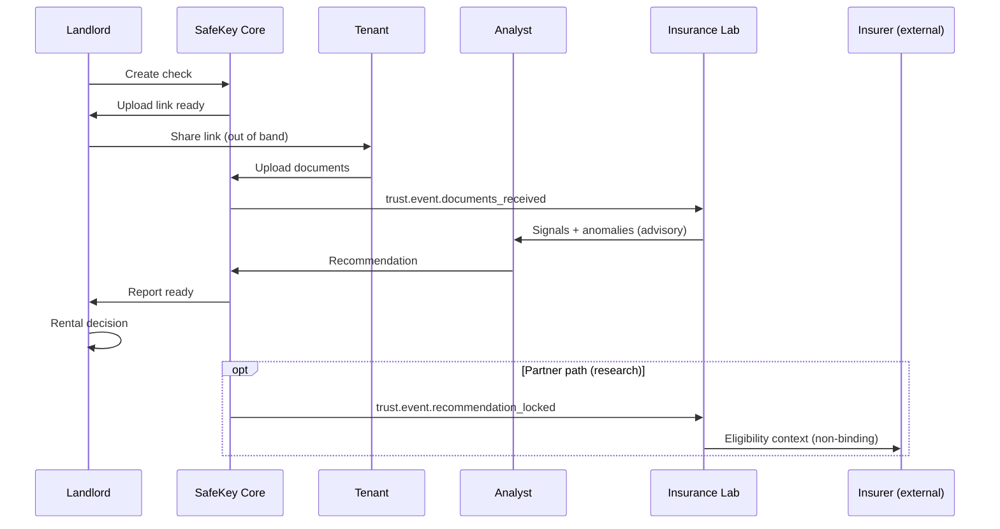

# System Context

Phase 2 institutional context for SafeKey Insurance Lab. **Documentation only** — no production binding.

## 1. System context

SafeKey operates as a **rental trust infrastructure** stack split across two intentional boundaries:

| Zone | Role | Users | Data sensitivity |
|------|------|-------|------------------|
| **Core** | Screening workflow, secure upload, human recommendation | Landlords, tenants (upload only) | PII, financial documents, case status |
| **Lab** | Trust intelligence, compliance automation, claims simulation, partner handoff research | Internal analysts, insurer partners (research), regulators (bounded read) | Derived signals, audit artifacts, simulated claim contexts |
| **Partner edge** (conceptual) | Eligibility and claims context exchange | Insurers, MGAs, reinsurers | Tokenized case references, eligibility payloads |

Core **creates** trust artifacts (checks, uploads, reviews, recommendations). Lab **interprets** those artifacts into signals, anomalies, and simulated insurance contexts without replacing Core as the landlord-facing product.

### Context diagram

---

## 2. Actor map

### 2.1 Primary actors

| Actor | Goal | Touches | Authority |
|-------|------|---------|-----------|
| **Landlord / property operator** | Defensible rental decision | Core only | Accepts or rejects tenant; never sees Lab agents |
| **Tenant applicant** | Submit evidence securely | Core upload portal | Consent-bound submission; no Lab visibility |
| **SafeKey analyst** | Complete structured review | Core review desk + Lab audit read | Issues recommendation; may trigger Lab escalation |
| **Billing / account admin** | Entitlements and plans | Core billing | No trust-signal write access |
| **Lab operations lead** | Agent orchestration policy | Lab control plane (research) | Configures agent scope; cannot override human recommendation |
| **Insurer underwriter** | Coverage binding | Partner edge (external) | Final insurance decision |
| **Regulator / auditor** | Compliance verification | Lab audit read window | Read-only, time-bounded, minimized fields |

### 2.2 Secondary actors

| Actor | Role |
|-------|------|
| **Protection partner (MGA)** | Receives eligibility context; no raw document access by default |
| **Legal / DPO** | GDPR and retention policy owner |
| **QA reviewer** | Validates agent output quality in Lab |
| **Fraud investigator** | Human owner of fraud escalations |

### Actor interaction map

---

## 3. Responsibility boundaries

### 3.1 Core owns

- Landlord and tenant UX for screening workflow
- Case persistence, upload token lifecycle, document storage (production)
- Human-readable case status visible to landlord
- Recommendation output presented to landlord
- Billing gates for link activation and report export

### 3.2 Lab owns (research documentation scope)

- Trust event normalization and signal derivation
- Multi-agent analysis orchestration (conceptual)
- Anomaly detection and escalation **proposals**
- Claims **simulation** and counterfactual workflows
- Compliance and audit artifact generation
- Partner eligibility **context packages** (non-binding)

### 3.3 Explicitly shared (with contracts)

| Concern | Core responsibility | Lab responsibility |
|---------|---------------------|---------------------|
| Case identity | Canonical `case_id` | References only; no ID remapping |
| Document bytes | Storage + landlord/tenant access rules | Integrity hashes, classification signals |
| Recommendation | Human-authored outcome | May not overwrite; may annotate for partners |
| Retention | Product retention policy | Audit retention schedule (≥ Core minimum) |
| Localization | Landlord/tenant UI strings | Agent reasoning metadata (EN/EL research) |

### 3.4 Boundary rules

1. Lab agents **must not** mutate Core landlord UI or tenant upload routes.
2. Lab agents **must not** send communications to tenants or landlords without human-approved templates.
3. Partner payloads **must not** include full document images unless explicit consent + contract tier allows.
4. Regulator visibility **must not** exceed statutory minimum necessary fields.

---

## 4. Trust lifecycle ownership

Each lifecycle stage has a **single owning authority** for decisions and a **secondary consumer** for intelligence.

| Stage | State (conceptual) | Decision owner | Lab role |
|-------|-------------------|----------------|----------|
| **Intake** | Check created | Landlord | None (pre-event) |
| **Invitation** | Upload link active | Landlord (send) / Core (token) | Fraud Signal Agent may flag link abuse patterns |
| **Tenant submission** | Documents received | Tenant (consent) | Document Integrity + Compliance agents observe |
| **Verification** | Under review | SafeKey analyst | QA, Compliance, Fraud agents assist |
| **Recommendation** | Report ready | SafeKey analyst | Risk Drift Agent compares to historical baseline |
| **Landlord decision** | Accepted / declined | Landlord | No agent override |
| **Partner handoff** | Eligibility context | Insurer underwriter (binding) | Lab packages simulation only |
| **Claims context** | Post-tenancy event | Insurer + human claims adjuster | Claims simulation (Phase 2 research) |
| **Archive** | Retention expiry | Legal / DPO | Audit Agent certifies destruction log |

### Lifecycle swimlane

### Ownership principle

> **If a stage affects a person's rights (tenancy, coverage, fraud accusation), a named human role owns the outcome.** Lab output is evidentiary input, not verdict.

---

## 5. Trust object model (conceptual)

| Object | Created by | Immutable after |
|--------|------------|-----------------|
| `TrustCase` | Core | Case seal at recommendation lock |
| `TrustEvent` | Core → Lab ingress | Append-only |
| `TrustSignal` | Lab agents | Versioned; supersede, never silent delete |
| `Escalation` | Lab agents | Resolution record appended |
| `AuditEntry` | Audit Agent | Never mutable |
| `ClaimsContext` (simulation) | Lab simulation | Tagged `SIMULATED` always |

---

## 6. Deployment isolation (target research posture)

When Lab eventually moves from paper architecture to isolated infrastructure:

- Separate project / VPC from Core production
- Read replicas or event bus from Core — **no write-back** to Core tables
- Agent runtime sandbox with outbound network restrictions
- Partner API keys scoped to Lab edge only

**Phase 2 does not implement this isolation** — it documents the intended boundary for institutional review.
