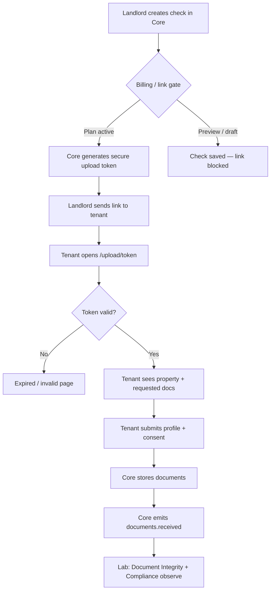
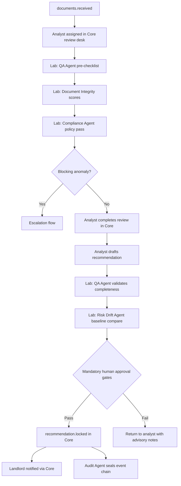
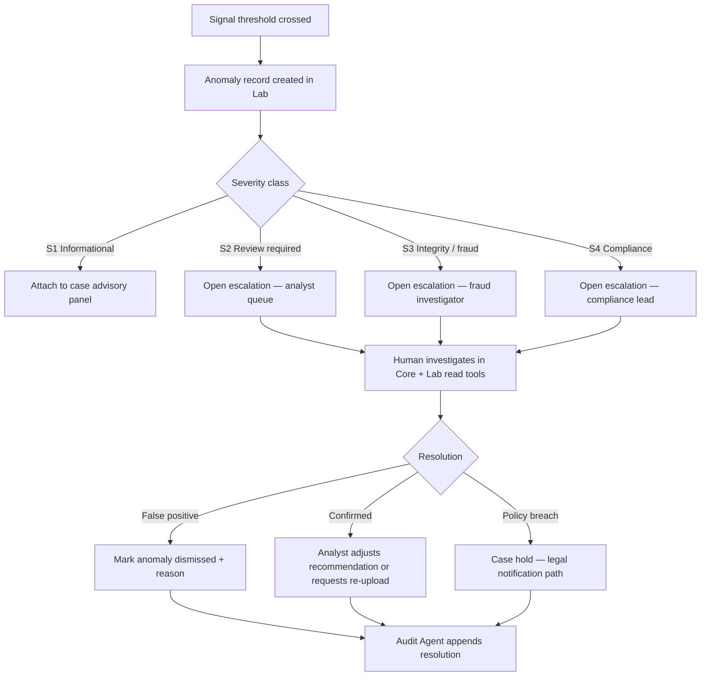
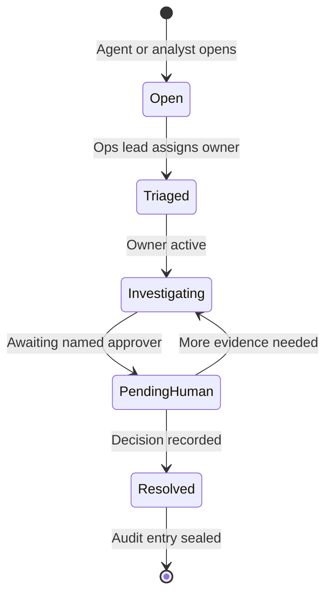
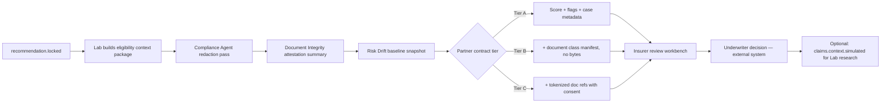
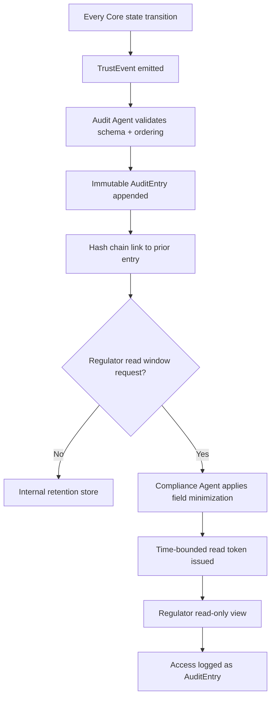
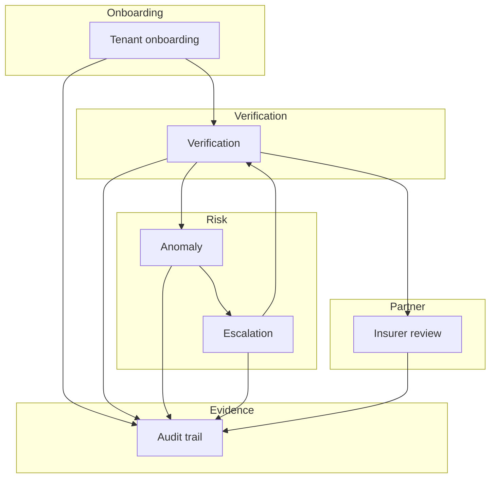

# Trust Event Flows

Conceptual event-driven flows for SafeKey Insurance Lab Phase 2. **Documentation only.**

All flows assume:

- SafeKey Core remains the landlord-facing system of record
- Lab consumes **trust events** asynchronously
- Humans retain authority at every binding step

---

## Event taxonomy (conceptual)

| Event | Emitter | Lab subscribers |
|-------|---------|-----------------|
| `check.created` | Core | Compliance Agent (policy snapshot) |
| `upload.link_activated` | Core | Fraud Signal Agent |
| `documents.received` | Core | Document Integrity, Compliance, QA |
| `documents.batch_submitted` | Core | Document Integrity, Fraud Signal |
| `review.requested` | Core | QA Agent, Compliance Agent |
| `recommendation.drafted` | Core (analyst) | QA Agent, Risk Drift Agent |
| `recommendation.locked` | Core | Audit Agent, partner export (research) |
| `anomaly.detected` | Lab | Escalation flow (human) |
| `escalation.opened` / `escalation.resolved` | Lab | Audit Agent |
| `claims.context.simulated` | Lab | Claims simulation only |

---

## 1. Tenant onboarding flow

**Purpose:** Document how a tenant enters the trust lifecycle without Lab touching Core UX.

### Ownership

| Step | Owner |
|------|-------|
| Link generation | Core |
| Tenant UX | Core |
| Consent capture | Core (tenant action) |
| Signal generation | Lab (advisory) |

### Lab constraints during onboarding

- Agents may **not** email tenants directly
- Agents may **not** alter requested document lists visible to tenant
- Fraud Agent may flag **link access anomalies** (velocity, geo, device) for human review

---

## 2. Verification flow

**Purpose:** Structured review from document receipt to locked recommendation.

### Human gates (mandatory)

- Analyst must explicitly lock recommendation (Core action)
- QA Agent **cannot** auto-approve incomplete packs
- Compliance Agent **cannot** clear regulatory flags without analyst acknowledgment

---

## 3. Anomaly flow

**Purpose:** Detect, classify, and route inconsistencies without auto-punitive action.

### Anomaly categories (conceptual)

| Category | Example | Auto-action allowed |
|----------|---------|---------------------|
| Document integrity | Hash mismatch, tamper metadata | **No** — escalate only |
| Identity continuity | Name mismatch across docs | **No** |
| Timeline | Employment start after stated move-in | **No** |
| Behavioral | Impossible upload velocity | **No** — flag only |
| Compliance | Missing consent artifact | **No** — block lock until human confirms |

---

## 4. Escalation flow

**Purpose:** Standardize human takeover when agents cannot proceed safely.

### Escalation SLAs (research targets)

| Severity | Target triage | Approver |
|----------|---------------|----------|
| S2 | 4 business hours | Senior analyst |
| S3 | 1 business hour | Fraud investigator + analyst |
| S4 | Immediate queue | Compliance lead + DPO if PII involved |

### Escalation rights

| Role | Can open | Can resolve | Can downgrade severity |
|------|----------|-------------|------------------------|
| Lab agent | Yes (proposal) | **No** | **No** |
| Analyst | Yes | Yes (S2) | Yes with reason |
| Fraud investigator | Yes | Yes (S3) | Yes with reason |
| Compliance lead | Yes | Yes (S4) | Yes with audit note |
| Landlord | **No** | **No** | **No** |

---

## 5. Insurer review flow

**Purpose:** Conceptual handoff from locked recommendation to partner underwriting context. **Non-binding.**

### Insurer visibility defaults

| Field | Default visibility |
|-------|-------------------|
| Recommendation enum | Yes |
| Risk score | Yes (contractual) |
| Red flag summaries | Yes (human-authored + agent-attributed) |
| Raw document images | **No** unless Tier C + consent |
| Tenant contact details | **No** |
| Landlord PII | Minimized |

### Binding decision rule

> Insurer underwriter **always** owns bind / decline / conditional. Lab packages are **decision support**, not decision replacement.

---

## 6. Audit trail flow

**Purpose:** Append-only evidence chain from case creation through partner export and simulation.

### Audit entry minimum fields

- `entry_id`, `case_id`, `timestamp_utc`
- `actor_type` (human | agent | system)
- `actor_id` (pseudonymized for agents)
- `action`, `payload_hash`, `prior_entry_hash`
- `jurisdiction`, `retention_class`

### Immutability rules

- No `UPDATE` or `DELETE` on audit entries
- Corrections append superseding entries with reference to corrected `entry_id`
- Agent reasoning logs stored as hashed attachments, not inline mutable text

---

## Cross-flow orchestration

All flows terminate in **human-readable outcomes** for Core users and **immutable audit artifacts** for Lab governance.
