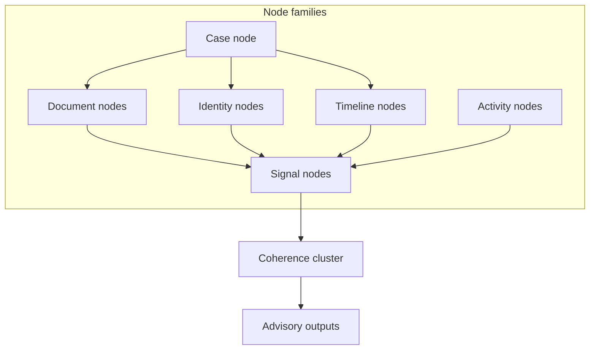
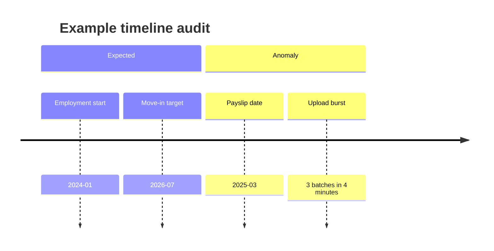
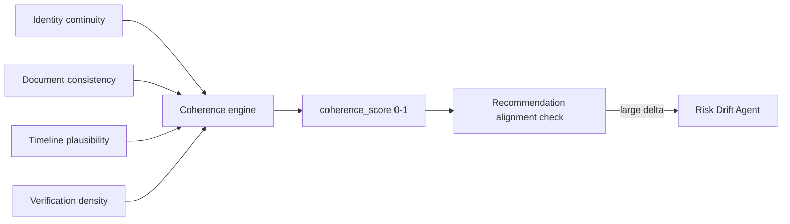
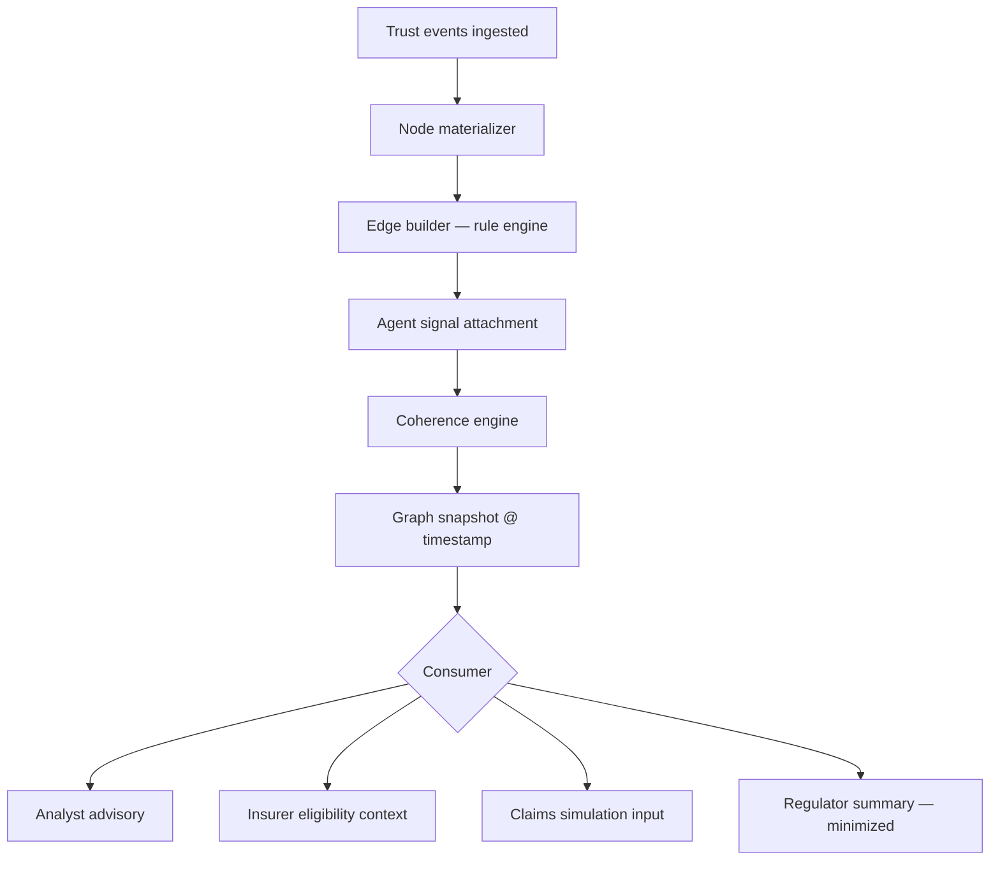

# Trust Intelligence Graph

Conceptual graph model for SafeKey Insurance Lab Phase 2. **Documentation only.**

The Trust Intelligence Graph (TIG) is a **research abstraction** for connecting verification signals, temporal facts, and behavioral evidence into a coherent trust picture — without exposing graph complexity to SafeKey Core landlords.

---

## 1. Graph purpose

| Goal | Non-goal |
|------|----------|
| Unify signals from agents into explainable coherence | Replace human analyst judgment |
| Support insurer eligibility and claims simulation | Real-time landlord dashboard graph |
| Detect cross-dimensional inconsistency | Automated tenant scoring visible to applicants |
| Feed audit and regulator summaries | Black-box sole decision |

---

## 2. Graph topology (conceptual)

### Node types

| Node | Examples | Source |
|------|----------|--------|
| **Case** | `case_id`, lock state, jurisdiction | Core |
| **Identity** | Legal name, ID doc ref, profile email | Core + Document Integrity |
| **Document** | Payslip, bank statement, contract class | Core manifest |
| **Timeline** | Move-in date, employment start, upload timestamps | Core + tenant profile |
| **Signal** | Integrity score, fraud velocity, compliance flag | Lab agents |
| **Activity** | Upload sessions, link opens (hashed) | Core telemetry → Lab |

### Edge types

| Edge | Meaning |
|------|---------|
| `asserts` | Document asserts identity or income fact |
| `supports` | Signal supports a fact |
| `contradicts` | Signal undermines a fact |
| `temporal_before` / `temporal_after` | Ordering constraint |
| `same_entity` | Probabilistic linkage (human confirm required) |
| `derived_from` | Signal lineage |

---

## 3. Signal dimensions (detailed)

### 3.1 Identity continuity

**Definition:** Stability and consistency of identity attributes across the verification lifecycle.

| Signal | Detection (conceptual) | Escalation |
|--------|------------------------|------------|
| Name variant mismatch | OCR name ≠ profile name | S2 |
| ID expiry before move-in | Date parse on ID doc | S2 |
| Email domain risk | Advisory only — not accusation | S2 |
| Cross-case hash match | Same ID image reused | S3 proposal |

**Output:** `identity_continuity_score` + human-readable gap list.

---

### 3.2 Document consistency

**Definition:** Internal consistency among submitted documents and requested pack.

| Signal | Example |
|--------|---------|
| Income mismatch | Payslip net ≠ bank inflow pattern |
| Employer mismatch | Contract employer ≠ payslip employer |
| Address drift | Utility bill ≠ stated current address |
| Missing requested class | Landlord requested payslips — none uploaded |

**Agent owner:** Document Integrity (primary), QA Agent (coverage).

---

### 3.3 Timeline anomalies

**Definition:** Temporal ordering that violates plausibility rules.

| Anomaly | Severity |
|---------|----------|
| Move-in before employment start | S2 |
| Document dated after upload but claimed historical | S3 |
| Impossible travel (upload geo hop) | S3 proposal |

**Agent owner:** Fraud Signal + Document Integrity.

---

### 3.4 Verification density

**Definition:** Completeness and depth of evidence relative to requested pack and property risk tier.

| Metric | Formula (conceptual) |
|--------|----------------------|
| `pack_coverage` | uploaded classes / requested classes |
| `trust_indicator_depth` | weighted count of financial evidence |
| `optional_enrichment` | bonus docs beyond minimum |

Low density **does not** auto-decline — triggers QA checklist and analyst note requirement.

---

### 3.5 Evidence coherence

**Definition:** Holistic compatibility score across identity, documents, timeline, and signals.

| coherence band | Interpretation | Action |
|----------------|----------------|--------|
| 0.85 – 1.0 | Strong alignment | Advisory pass |
| 0.65 – 0.84 | Minor gaps | Analyst note suggested |
| 0.45 – 0.64 | Material gaps | S2 escalation |
| < 0.45 | Severe incoherence | S3 proposal + hold lock |

Coherence **never** overrides locked human recommendation retroactively without escalation workflow.

---

### 3.6 Behavioral trust signals

**Definition:** Non-document behavioral indicators — **high sensitivity**, strict governance.

| Signal | Collection | Visibility |
|--------|------------|------------|
| Upload session velocity | Hashed session telemetry | Fraud investigator |
| Link access pattern | Token open counts, geo coarse | Fraud investigator |
| Re-upload frequency | Core events | Analyst advisory |
| Device stability | Fingerprint hash | Fraud investigator |

**Prohibited uses (Phase 2 research policy):**

- No behavioral score shown to landlord
- No automated decline on behavioral signal alone
- No protected-class proxy features (documented in bias review)

---

## 4. Graph computation pipeline

Snapshots are **versioned** and referenced by audit entries at recommendation lock.

---

## 5. Graph outputs (advisory only)

| Output | Consumer | Core visible? |
|--------|----------|---------------|
| Coherence score | Analyst | Optional summary only (future research) |
| Gap checklist | Analyst | Via review desk — not landlord |
| Drift delta | Risk Drift Agent | No |
| Fraud pattern graph | Fraud investigator | No |
| Minimized coherence summary | Insurer partner | No landlord access |

---

## 6. Data minimization in graph storage

- Tenant PII stored as salted token references in Lab graph
- Document content addressed by hash + class — not duplicate storage unless Lab mirror policy approved
- Graph exports for partners use **structural summary** (counts, classes, scores) not full node dump

---

## 7. Relationship to claims simulation

At claims simulation time, the graph is **rehydrated** from `VerificationSnapshot`:

1. Load graph snapshot at lock timestamp
2. Overlay simulated `ClaimsEvent` node
3. Recompute coherence **counterfactually**
4. Produce delta report for adjuster briefing

This is research-only — see [Claims simulation](./claims-simulation.md).

---

## 8. Future research extensions (not Phase 2 scope)

- Cross-portfolio graph analytics for insurers (aggregated, k-anonymized)
- Graph neural network experimentation in isolated sandbox
- Real-time graph updates during upload (still advisory)

None of the above may ship in SafeKey Core without separate product and legal review.
